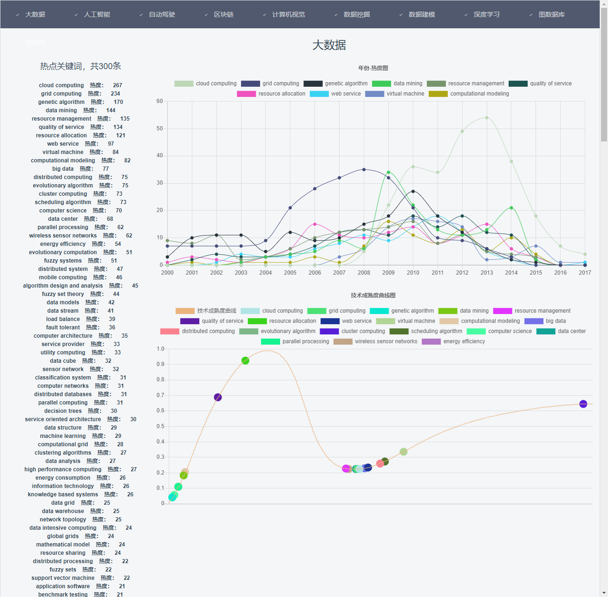

# 技术趋势分析网站
2019/4/25  
[返回首页](https://desperadoadil.github.io/)

---
[View on Github](https://github.com/DesperadoAdil/TechnicalTrendAnalysis)  
项目结构
```python
|-- TrendAnalysis
    |-- .gitignore
    |-- README.md
    |-- backend                                     #后端
    |   |-- apidoc.json                             #apidoc格式文件
    |   |-- config.py                               #Flask配置文件
    |   |-- footer.md                               #apidoc页脚
    |   |-- header.md                               #apidoc页眉
    |   |-- hype_cycle.bmp                          #技术成熟度曲线
    |   |-- README.md                               #后端README
    |   |-- requirements.txt                        #Flask依赖库文件
    |   |-- run.py                                  #后端项目启动入口
    |   |-- app
    |       |-- cache                               #数据本地缓存文件
    |       |-- hype_cycle.py                       #计算关键词映射到技术成熟度曲线的位置
    |       |-- utils.py                            #数据爬虫
    |       |-- views.py                            #视图函数文件
    |       |-- __init__.py                         #app包标识
    |       |-- static                              #后端静态文件
    |       |   |-- css
    |       |   |-- fonts
    |       |   |-- img
    |       |   |-- js
    |       |-- templates                           #后端网页模板
    |           |-- index.html
    |-- docs                                        #文档
    |   |-- TrendAnalysis.md                        #报告
    |   |-- apidoc                                  #api文档
    |       |-- index.html                          #apidoc文档入口
    |-- frontend                                    #前端
        |-- .babelrc
        |-- .editorconfig
        |-- .gitignore
        |-- .postcssrc.js
        |-- index.html                              #前端网页模板
        |-- package-lock.json
        |-- package.json
        |-- README.md                               #前端README
        |-- build
        |   |-- build.js
        |   |-- check-versions.js
        |   |-- logo.png
        |   |-- utils.js
        |   |-- vue-loader.conf.js
        |   |-- webpack.base.conf.js
        |   |-- webpack.dev.conf.js
        |   |-- webpack.prod.conf.js
        |-- config                                  #前端配置文件
        |   |-- dev.env.js
        |   |-- index.js
        |   |-- prod.env.js
        |-- dist
        |   |-- index.html                          #build生成的网页
        |   |-- static                              #build生成的静态文件
        |       |-- css
        |       |-- fonts
        |       |-- img
        |       |-- js
        |-- src                                     #前端代码源文件
        |   |-- App.vue                             #App组件
        |   |-- main.js
        |   |-- assets
        |   |   |-- logo.png
        |   |-- components
        |   |   |-- TrendAnalysis.vue               #主页组件
        |   |-- router
        |       |-- index.js                        #路由管理文件
        |-- static
            |-- .gitkeep

```

## 项目启动
- 启动前提
    - 需要在本机6379端口运行Redis服务端  
- 支持前后端分离  
    - 进入backend文件运行`python run.py`或 `python run.py debug`（debug模式）  
        部署在本机80端口
    - 进入frontend文件运行`npm run dev`  
        部署在本机8080端口
- 后端有完整的网页模板和静态文件，所以也可以只启动后端  
    - 进入backend文件运行`python run.py`或 `python run.py debug`（debug模式）  

## 项目实现方法
- 后端  
    - Flask+Cache+Redis  
    - 后端框架采用Python Flask，需要Flask 1.0.2  
    - 注意到数据源网站响应比较慢，于是采用提前获取数据做本地缓存的方式，缓存文件在/backend/app/cache中  
    - 在计算关键词映射到技术成熟度曲线的位置时，发现计算量比较大，网页响应很慢，于是采用提前计算并存在本地缓存当中  
    - 为了进一堵提高网站响应速度，我利用了Flask里的钩子函数before_first_request()，在用户第一次请求之前就计算好所有领域的热度信息并建立索引，然后缓存到Redis中间件中，需要提前运行redis服务端于本机6379端口  
- 前端  
    - Vue.js+iView+axios  
    - 前端采用Vue.js框架，UI采用iView，http方法用axios  
    - 顶部导航栏，下面采用1:3的比例分为左右两部分，左边是按热度排序的关键词，右边是年份-热度图和技术成熟度曲线图，注意到三部分并没有先后关系，所以并行获取数据  
- api文档  
    - 详见/docs/apidoc/index.html  
    - 使用[apidoc](https://github.com/apidoc/apidoc)生成  

## 可视化方法Chart.js
- 年份热度图
    ```js
    var c = document.getElementById("myChart")
    var ctx = c.getContext("2d")
    ctx.clearRect(0, 0, c.width, c.height)              //清空画布
    ctx.beginPath()

    this.$http.post('/api/graphdata', data).then(res => {
      if (this.chart1 != null) this.chart1.destroy();     //销毁之前的图标实例
      this.chart1 = new Chart(ctx, {
        type: "line",                                     //折线图
        data: res.data,                                   //数据由后端构造成指定形式，前端直接载入即可
        options: {                                        //一些参数，例如标题，X轴Y轴大小等
          title : {
            display: true,
            text: '年份-热度图'
          }
        }
      });
    })
    ```

- 技术成熟度曲线图  
    基本同上，但有几点特别：  
    1.技术成熟度曲线是由大量点构成的，那么为了加快绘制线条的速度，禁用了贝塞尔曲线  
    2.X轴Y轴均是0到1  
    ```js
    options: {
      title : {
        display: true,
        text: '技术成熟度曲线图'
      },
      elements: {
        line: {
          tension: 0 // disables bezier curves
        }
      },
      scales: {
        xAxes: [{
          ticks: {
            beginAtZero: true,
            max: 1,
            min: 0
          }
        }],
        yAxes: [{
          ticks: {
            beginAtZero: true,
            max: 1,
            min: 0
          }
        }]
      }
    }
    ```

## 关键词映射到技术成熟度曲线位置的方法
采用了已有的关键词映射到技术成熟度曲线位置的方法  

## 效果截图
  
  
